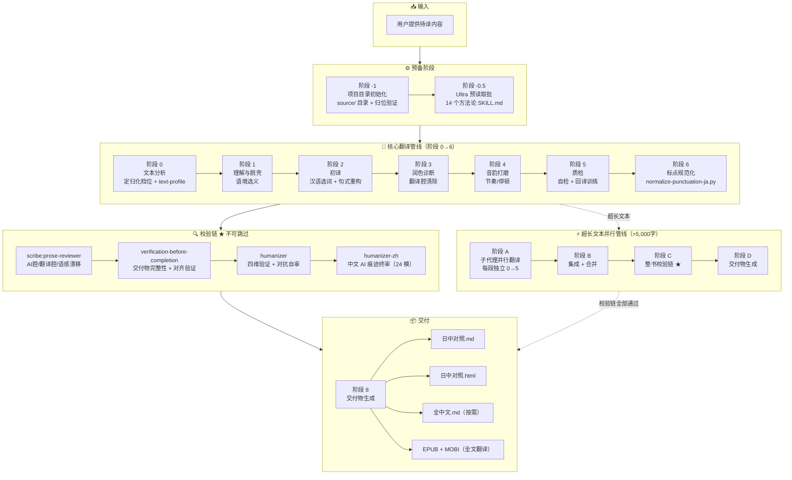
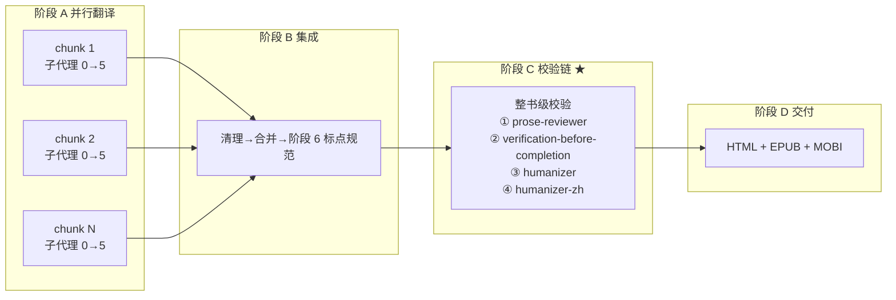

# jp-zh-max 翻译工作流流程图

> 完整管线：从输入到交付，含校验链 ★ 不可跳过



## 阶段说明

| 阶段 | 名称 | 核心产出 | 准出条件 |
|------|------|---------|---------|
| **-1** | 项目初始化 | `source/` 目录 + 归位验证 | 原始文件移入，提取产物生成 |
| **-0.5** | Ultra 预读取 ★ | 14 个方法论文件已读 | INDEX.md + 13 个 skill 全部 Read 完成 |
| **0** | 文本分析 | text-profile 写入头部 | 档位/自由度/文本类型/语域 四项非占位符 |
| **1** | 理解与脱壳 | 语境选义记录 | 同形汉字陷阱标记完成 |
| **2** | 初译 | 日中对照初稿 | 每段标记 `[v3·W]` 或 `[v3·S]` |
| **3** | 润色诊断 | 翻译腔消除稿 | 和製漢語/連体修飾/曖昧表現 三类问题已处理 |
| **4** | 音韵打磨 | 节奏优化稿 | 长句拆解、拗口处调整 |
| **5** | 质检 | 自检通过稿 | 每段标 `[v3·Q✓]` |
| **6** | 标点规范 | 約物标准化 | `normalize-punctuation-ja.py` 残留 = 0 |
| **7 / C** | 校验链 ★ | 四道审查全部通过 | see below ↓ |
| **8 / D** | 交付 | .md + .html + 按需格式 | 用户确认交付 |

## 校验链详解 ★

```
阶段 6 通过
    ↓
① scribe:prose-reviewer
    └── 整书级 AI 腔/翻译腔/语感漂移审查
    └── 未通过 → 标记问题段落，退回阶段 5
    ↓
② superpowers:verification-before-completion
    └── 交付物完整性检查
    └── 日中对齐验证（每段日语有对应中文）
    └── 未通过 → 补全缺失部分
    ↓
③ humanizer
    └── 四维验证：Fidelity / Naturalness / Grammar / AI Patterns
    └── 强制对抗自审，原位修复
    └── 未通过 → 标记问题类型，退回阶段 3-5 对应环节
    ↓
④ humanizer-zh
    └── 中文 AI 痕迹终审（24 种模式）
    └── 原位修复
    └── 未通过 → 退回阶段 5
    ↓
阶段 8 交付
```

> ⚠ **核心铁律：** 校验链任何一步未通过 = 翻译未完成。不允许跳过任一环节直接交付。

## 超长文本并行翻译流程图



## 跳过规则

| 场景 | 跳过内容 |
|------|---------|
| 聊天小段翻译（不落盘） | 跳过全部 ultra 接入（预读取 + invoke），直接阶段 0 |
| 硬文本（自由度 1-3） | 跳过审美制约机制 + 修辞双技能 invoke |
| 用户要求快速出稿 | 跳过全部 ultra 接入 |
| 短篇 < 2,000 字 | 阶段 -0.5 仅读 7 个核心文件 |
| 超长文本 > 5,000 字 | 核心管线改为并行模式，校验链改为整书级 |

---

*流程图使用 Mermaid 语法，GitHub 自动渲染。*
